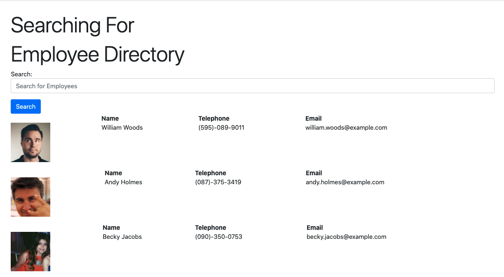

# Employee-Directory
This app tracks all information related to your Employees with their name, email, and cell phone number. With the ability to sort out different employees with the search bar.
## Deployed application
Deployed on heroku
## How it works
First pull up the webpage and see the search bar and the populated Employees (using random user api). Then to filter out by name type the name your inquiring about and it will appear as that employee information.
## User Story
```
As a business owner
I want to be able to view and manage all employees information in my company
So that I can organize and communicate better with my staff.
```
# Display
